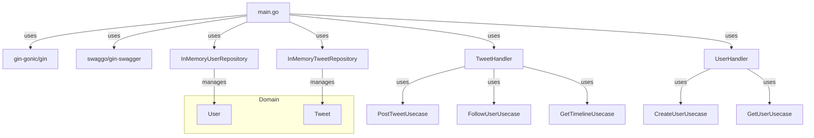

# uala-microblog-challenge

El README se divide en 2 partes, la primera es la explicacion teorica del problema y la solucion, la segunda parte es como correr el proyecto.

## El problema

El problema propuesto es un problema de arquitectur actuala de microservicios y competencia de recursos. Tenemos un sistema con muchas operaciones de lecto escrituras al mismo tiempo (competencia de recursos), de muchos vectores distintos. Es decir, cada nuevo flujo de informacion debe ser tratado atomicamente, por lo cual necesitamos utilizar distintos mecanismos para saltear esos bottlenecks. 

Primero hablemos de la arquitectura del proyecto, decisiones de diseño y como se implemento. En el otro apartado nos adentramos en el problema principal y la solucion hipotetica.

### Arquitectura de la implementacion
- **dockerizado**: Tener el servicio en contenedores hace que sea compatible con la mayoria de las infraestructuras modernas que utilizan contenedores como es kubernetes, no requiere de una maquina virtual / vps, son entornos reproducibles y esteriles. (En mi opinion es una de las mayores joyas que tenemos de la ingenieria moderna) de yapa un desarrollador no necesita instalar go y setear todo el ambiente en su maquina de trabajo si no lo desea.
  - La imagen final del docker tiene el binario y no el codigo fuente, para que no se pueda acceder al codigo fuente desde el contenedor (hipotetico caso de que alguien quiera acceder al contenedor).
- **REST HTTP**: Las consultas son muy simples como para contemplar otro tipo de arquitectura, REST se ajusta bien a estas consultas atomicas `lo viejo funciona, Juan`.
- **base de datos** es una base de datos en memoria (practicidad). De querer usar una base de datos persistente, perosnalmente optaria por una base de datos relacional como mysql o postgres. Considero que es menester en un proyecto serio utilizar bases de datos relacionales, nos obligan a pensar en la estructura de los datos y por ende, el flujo de la informacion, escalan facilmente y son muy robustas. 
  - Soy pro usar ORM excepto en casos donde sea importante correr querys mas especificas/criticas, el ORM permite a los desarrolladores enfocarse en la logica de la aplicacion y no en la sintaxis de la base de datos.
- **Arquitectura hexagonal**: Separa la logica de la aplicacion de la infraestructura. Esto nos permite cambiar la infraestructura sin afectar la logica de la aplicacion. Osea, si quisieramos cambiar la base de datos de la memoria a la de postgres, no necesitariamos mas que hacer la implementacion en la infraestructura.
- **Makefile**: Utilice make para que correr comandos y el sistema sea facil.
- **Swagger**: Genero la documentacion de la api con swagger, para que sea facil de entender y probar.
- **Tests**: Hice tests unitarios en go y de integracion con bash, para cargar datos de prueba.
- **Paquete internal**: Utilice el paquete internal para que los archivos sean privados y no se puedan acceder desde fuera del paquete.
- **Carpetas**: Dividi el proyecto en carpetas como domain, infra, interfaces y usecases, para que el proyecto sea mas organizado y facil de entender. 
  - Personalmente en proyectos grandes prefiero dividir en paquetes segun el tipo de dato / operacion ej: tweets. users. En vez de tener todos los handlers o usecases en un mismo paquete. Creo que es mas facil de entender el alcance del codigo de uno cuando esta bien seccionado.

### Estructura del codigo

El codigo se divide en:
- **main.go**: El archivo principal que ejecuta el servidor y configura la api REST (GIN).
- **infrastructure**: Contiene la implementacion de la infraestructura, como la base de datos (repositorios), abstrae la logica de la aplicacion de la infraestructura.
- **interfaces**: Contiene las interfaces de los handlers, es lo que abstrae la api REST de la logica de la aplicacion.
- **usecases**: Contiene las operaciones de la aplicacion / logica de negocio.
- **domain**: Contiene los datos / modelos.
- **scripts**: Contiene scripts de carga de datos de prueba.
- **docs**: Contiene la documentacion de la api / swagger.

La idea es mantenerlo bien separado mediante injeccion de dependencias, para que el codigo sea facil de entender y mantener. Si uno quisiera cambiar de implementacion, solo deberia implementar las interfaces y cargarlas segun corresponda.

### Problema principal: Optimizacion de lectura de tweets / timeline

> Es un problema de arquitectura de microservicios y competencia de recursos.

La implementacion actual es muy simple (e ineficiente), se leen todos los tweets desde la base de datos, de los usuarios que sigue el usuario principal y se ordenan en el serivcio por fecha.

Existen los siguientes bottlenecks:
- Se leen TODOS los tweets de cada usuario seguido para luego procesarlos.
  - **Explicacion:** Esto satura la memoria, especialmente cuando es concurrente, tiene un costo computacional de O(n*m) siendo N el numero de usuarios que sigue el usuario principal y M el numero de tweets de cada usuario. Facilmente saturamos el sistema si aumentan los usuarios o los tweets.
  - **Solucion:** Una primera optimizacion (legacy) seria tener la base de datos indexada segun fecha y tener querys preparadas para obtener los ultimos X tweets de los usuarios seguidos. 
- No es escalable a millones de usuarios compartiendo tweets al mismo tiempo.
  - **Explicacion:** Asumiendo que hacemos la implementacion propuesta anteriormente, las operaciones de lectura y escritura en la base de datos llevan tiempo ya que no se puede leer y escribir a la vez (el clasico problema de concurrencia). En sistemas pequeños con poca actividad concurrente esto no es un problema (no pasa nada si el sistema no nos trae los ultimos tweets o se demora unos segundos), pero en sistemas grandes donde todos estan escribiendo y leyendo tweets al mismo tiempo, el bottleneck se vuelve muy evidente.
  - **Solucion:** La solucion clasica de estos problemas es la de implementar un sistema de cache intermedio que permite escribir y leer los tweets de los usuarios seguidos, sacando el costo de leer de la base de datos.

En mi **solucion hipotetica implementaria** un sistema de cache estilo clave-valor (redis) para llevar una lista de los ultimos tweets en la plataforma y por otro lado desacoplaria la escritura a la base de datos mediante una cola de mensajes (rabbitmq/kafka) a un worker que se encargue de escribir los tweets en la base de datos.
- El **servicio** es un pasa manos. Recibe los tweets nuevos, los escribe en el cache y delegar la escritura de los tweets un worker. Por otro lado, lee los ultimos tweets de la cache cuando es posible, y solo cuando no hay tweets en la cache, lee los tweets de la base de datos.
  - Esto evita que en el hipotetico caso de que el servicio se caiga, no se pierdan los ultimos tweets, preservando la informacion.
  - Nose permite escalar a mayor trafico sin problema.
  - Sacamos el peso de escribir en la base de datos del servicio principal, lo cual nos deja el servicio mas liviano y rapido.
- La **cache** tiene como clave el ID del usuario y como valor una lista de tweets ordenada por fecha. 
  - Las operaciones de lectura y escritura en cache son de O(1), lo cual es muy eficiente. Y no necesitan locks ya que redis es un sistema distribuido. 
  - La lista de tweets se ordena por fecha, lo cual nos optimiza el ordenamiento en el servicio.
  - El sistema va a estar condicionado por la capacidad de la cache. A mayor cantidad de "tweets" guardados, mas costoso en memoria. 
  - Se puede optimizar mas agregando niveles de cache (ej: seccionar caches segun cantidad de seguidores o relevancia de los tweets), simulando lo que hacen los procesadores con la memoria L2, L3, etc.
- El **worker** se encarga de leer los tweets de la cola de mensajes y escribirlos en la base de datos.
  - Este es un proceso que se puede escalar a demanda, ya que no es un proceso pesado.
  - Puede tardarse el tiempo que necesite en escribir los tweets en la base de datos, ya no afecta el servicio principal (al costo de que si la cola se llena, se puede perder informacion).
  - Desacopla el servicio principal de la base de datos.
  - Una optimizacion a mayor escala es que cada worker tenga su base de datos, para no competir con otros workers, y eventualmente tener jobs de consolidacion de datos.

## El proyecto

### Requisitos

- Go 1.20+ (o compatible)
- [swag](https://github.com/swaggo/swag) para generar la documentación Swagger (`go install github.com/swaggo/swag/cmd/swag@latest`)
- Docker (opcional)

### Instalación y ejecución local

1. Instalar dependencias:    `go mod tidy`

2. Generar la documentación Swagger:    `make swagger`

3. Compilar el proyecto:    `make build`

4. Ejecutar el servidor:    `make run`

La api estará disponible en http://localhost:8080/api/v1

---

## 🐳 Docker

1. Construir la imagen:    `make docker-build`

2. Ejecutar el contenedor:    `make docker-run`

---

## 📖 Documentación Swagger

La API expone su documentación interactiva utilizando Swagger:

- http://localhost:8080/api/v1/swagger/index.html

Desde ahí podes probar los endpoints, ver los parámetros y las respuestas esperadas.

---

## 🛠️ Tests

- `make test` — Ejecuta los unit tests.
- `make test-integration` — Ejecuta los tests de integración (es un script que crea usuarios, tweets y sigue a usuarios).

---

## 📦 Comandos útiles

- `make build` — Compila el binario principal.
- `make run` — Ejecuta el servidor localmente.
- `make swagger` — Genera la documentación Swagger.
- `make docker` — Construye y ejecuta el proyecto en Docker.

---

## ✍️ Autor

Carlos Santiago Yanzon  
https://github.com/bizk 
